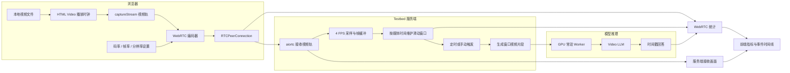

# Online Video LLM Testbed

一个面向在线长视频理解研究的可运行实验平台。它把本地视频当作实时媒体源，通过 WebRTC 按真实播放时钟发送到服务端；服务端只使用已经到达的画面构造时间窗口，并持续调用 Video LLM 回答问题。

本项目的目标不是只做一个视频问答网页，而是提供一套可以控制视频输入、网络编码、时间窗口、推理触发和 GPU 资源，并能记录传输与推理指标的 Online Video LLM 研究基线。

## 项目定位

传统离线视频问答通常默认模型可以一次性看到完整视频。Online Video LLM 面临的是另一类问题：

- 视频仍在持续到达，模型不能使用未来画面；
- 系统需要决定看哪些帧、保留多长历史以及何时回答；
- 视频编码、网络传输和推理延迟会共同影响最终结果；
- 长时间运行时需要处理记忆、重复回答、空回答和资源占用。

本项目把这些环节放进同一个 Testbed，使一次实验可以同时观察：

```text
视频内容与播放时钟
  + WebRTC 编码和传输
  + 服务端采样与窗口策略
  + Video LLM 推理
  + 回答质量、响应时间和系统开销
```

## 当前能力

### 1. 离线视频问答

- 上传本地视频或选择内置示例；
- 自动处理常见视频编码兼容问题；
- 配置 GPU、采样 clip 数量和最大输出长度；
- 展示任务阶段、模型回答和总耗时。

### 2. Online Video LLM 会话

- 无需开启摄像头，将本地视频作为实时 WebRTC 视频源；
- 服务端只缓存已经接收的帧，不读取尚未播放的未来内容；
- 按媒体时间维护滑动窗口，支持定时触发和手动立即提问；
- 以约 4 FPS 采样服务端实际收到的画面；
- 使用常驻单 GPU Worker，避免每个窗口重复加载模型；
- 两块 GPU 可以承载相互独立的会话，单次推理由一块 GPU 完成；
- 展示服务端接收画面、窗口范围、回答和事件时间线。

### 3. 网络编码控制与可观测性

- 通过 `RTCRtpSender.setParameters()` 动态设置码率上限；
- 动态设置最大帧率和分辨率缩放比例；
- 展示浏览器实际发送分辨率、帧率、码率和质量受限原因；
- 记录接收帧、采样帧、缓冲时长、传输延迟和 WebRTC 状态；
- 分别记录窗口总响应延迟和模型生成延迟。

需要注意：码率设置是对 WebRTC 编码器的上限约束，不等于编码器一定会达到该码率。浏览器的拥塞控制、源视频质量、分辨率和画面运动程度仍会共同决定实际码率。

### 4. VideoMME 快速评测

- 提供小规模 VideoMME 验证入口；
- 展示子集准确率、有效回答率和任务类型统计；
- 每道题均可查看题目、全部选项、模型原始输出、预测答案和标准答案；
- 适合验证评测链路，不用于替代完整数据集结果。

### 5. 工程化运行

- 支持真实模型模式和不加载权重的 Mock 模式；
- Worker 请求按 GPU 串行，降低并发推理导致显存不足的风险；
- 支持本地常驻服务、异常退出自动重启和健康检查；
- 模型权重、视频、上传文件和运行缓存均与源码仓库分离。

## 系统架构



### 一次在线会话的执行过程

1. 浏览器播放用户选择的视频，并通过 `captureStream()` 获取媒体轨道。
2. 浏览器和服务端通过 WebRTC SDP Offer/Answer 建立连接。
3. 浏览器发送视频轨，同时通过 DataChannel 上报发送端统计。
4. 服务端解码收到的画面，按约 4 FPS 采样并保留最近一个窗口。
5. 达到触发间隔或用户手动提问时，服务端把当前窗口编码成临时视频。
6. 对应 GPU 的常驻 Worker 调用模型推理，并返回可见文本。
7. 前端展示回答、媒体时间范围、帧数、传输指标和推理延迟。

### Sliding Window 的含义

窗口长度决定模型每次能够看到多长的已观测历史，触发间隔决定多久运行一次推理。例如：

```text
窗口长度 8 秒，触发间隔 4 秒：

窗口 1： 0–8 秒
窗口 2： 4–12 秒
窗口 3： 8–16 秒
```

此时相邻窗口重叠 4 秒。若窗口长度和触发间隔均为 8 秒，则是连续但不重叠的分段窗口：

```text
0–8 秒 → 8–16 秒 → 16–24 秒
```

当前每个窗口会重新执行一次模型推理，不复用前一个窗口的视觉特征、KV Cache 或语义记忆。

## 代码结构

```text
.
├── inference.py
├── online_video_llm/
│   ├── eval/
│   └── model/
│       ├── language_model/
│       ├── multimodal_encoder/
│       └── multimodal_projector/
├── web_demo/
│   ├── server.py
│   ├── model_worker.py
│   ├── smoke_test.py
│   ├── requirements-online.txt
│   ├── ONLINE_TESTBED.md
│   └── static/
├── scripts/
│   ├── run_online_testbed.sh
│   ├── download_model_watchdog.sh
│   ├── download_progress_monitor.sh
│   └── eval/videomme.sh
├── playground/data/
├── checkpoints/                 # 本地模型，不纳入 Git
└── tmp/                         # 视频、结果和运行缓存，不纳入 Git
```

| 路径 | 主要职责 |
| --- | --- |
| `inference.py` | 单视频推理入口和 `videoStream` 模型封装，负责视频读取、模型输入构造与文本生成。 |
| `online_video_llm/model/` | Video LLM 主体，包括语言模型、视觉编码器、多模态投影器和长视频压缩模块。 |
| `online_video_llm/eval/` | VideoMME 数据读取、推理和答案评估。 |
| `web_demo/server.py` | aiohttp 服务、HTTP API、WebRTC 信令、帧接收、窗口调度、离线任务和指标汇总。 |
| `web_demo/model_worker.py` | 常驻 GPU 的 JSONL Worker；模型只加载一次，后续请求复用同一进程。 |
| `web_demo/static/` | 离线推理、在线 Testbed 和评测看板的前端页面。 |
| `web_demo/smoke_test.py` | 使用合成视频轨验证 WebRTC、缓冲、预览和在线响应链路。 |
| `scripts/run_online_testbed.sh` | Testbed 统一启动入口。 |
| `scripts/eval/videomme.sh` | VideoMME 评测入口，可通过 `CUDA_VISIBLE_DEVICES` 配置 GPU。 |
| `playground/data/` | 快速评测配置和数据模板。 |
| `checkpoints/` | 本地模型权重及视觉模型依赖；目录被 Git 忽略。 |
| `tmp/` | 示例视频、窗口片段、上传文件、评测输出和 Hugging Face 缓存。 |

更详细的在线协议见 [`web_demo/ONLINE_TESTBED.md`](web_demo/ONLINE_TESTBED.md)。

## 环境与启动

当前验证环境：

- Python 3.10
- CUDA 11.8
- PyTorch 2.2
- Transformers 4.41
- FFmpeg
- NVIDIA GPU

本项目依赖已有的模型运行环境。在线传输部分的额外依赖可通过以下命令安装：

```bash
.venv/bin/pip install -r web_demo/requirements-online.txt
```

### 模型路径

模型路径按照以下优先级解析：

1. 环境变量 `ONLINE_VIDEO_LLM_MODEL_PATH`；
2. `checkpoints/model`；
3. `checkpoints/` 下包含兼容 `config.json` 的模型目录。

模型权重不包含在 Git 仓库中。

### 启动真实模型服务

```bash
scripts/run_online_testbed.sh
```

默认访问地址为 `http://localhost:7860`。

可以覆盖监听地址、端口和模型路径：

```bash
ONLINE_VIDEO_LLM_HOST=0.0.0.0 \
ONLINE_VIDEO_LLM_PORT=7860 \
ONLINE_VIDEO_LLM_MODEL_PATH=/path/to/model \
scripts/run_online_testbed.sh
```

### Mock 模式

Mock 模式不加载模型，适合快速验证浏览器、WebRTC 和界面：

```bash
scripts/run_online_testbed.sh --mock-model
```

### 端到端冒烟测试

默认使用合成视频和 Mock 模型：

```bash
cd web_demo
../.venv/bin/python smoke_test.py
```

加载真实模型测试：

```bash
cd web_demo
../.venv/bin/python smoke_test.py --real-model
```

### 单视频命令行推理

```bash
.venv/bin/python inference.py \
  --model_path /path/to/model \
  --video_path /path/to/video.mp4 \
  --prompt "Please describe what happens in this video."
```

### VideoMME 快速评测

```bash
CUDA_VISIBLE_DEVICES=1 bash scripts/eval/videomme.sh
```

快速评测数据模板位于 `playground/data/`。当前网页中的快速结果只是小规模链路验证，不能与论文完整 VideoMME 结果直接比较。

## 可观测指标

平台目前能够围绕三个层次记录实验数据。

### 传输层

- WebRTC 连接状态；
- 实际发送码率、帧率和分辨率；
- 发送包数和浏览器质量受限原因；
- 服务端接收帧数和估算传输延迟。

### 窗口与系统层

- 当前媒体时间；
- 窗口起止时间、缓冲时长和采样帧数；
- 自动或手动触发原因；
- GPU 选择、任务状态和完整事件时间线。

### 模型层

- 每次窗口推理的可见回答；
- 回答、静默和失败状态；
- 模型生成延迟；
- 从触发到结果返回的总延迟；
- VideoMME 预测、标注和逐题正确性。

## 基于本项目可以探索的问题

当前 Testbed 首先提供一个可控制、可测量的窗口式在线推理基线。以下问题已经可以直接开展小规模实验。

### 1. 时间窗口应该多长、多久触发一次？

可控制变量：

- 窗口长度：6、8、12、16 秒；
- 触发间隔：4、8、12、16 秒；
- 自动触发或手动触发；
- 重叠窗口或非重叠窗口。

可以研究：

- 长窗口是否提高上下文理解，但增加推理延迟和显存压力；
- 短窗口是否响应更快，却容易丢失跨时间事件；
- 窗口重叠能否减少事件被边界切断的问题；
- 不同任务类型是否需要不同窗口策略。

建议指标：任务准确率、有效回答率、空回答率、模型延迟、总响应延迟和单位视频分钟推理次数。

### 2. 视频编码质量如何影响模型理解？

可控制变量：

- 编码码率上限；
- 最大帧率；
- 分辨率缩放；
- 源视频内容和运动强度。

可以研究：

- 码率、帧率和分辨率分别对动作识别、目标识别和 OCR 的影响；
- 相同带宽预算下，“高分辨率低帧率”和“低分辨率高帧率”哪个更适合不同任务；
- 浏览器实际编码结果与模型准确率之间是否存在稳定关系；
- 画质下降到什么程度时，模型开始大量静默或产生错误回答。

建议指标：实际发送码率、实际分辨率、服务端接收质量、回答正确率、OCR 正确率和空回答率。

### 3. Online 推理与 Offline 推理有多大差距？

可以对同一视频和问题分别运行：

- 完整视频离线推理；
- 固定窗口在线推理；
- 不同窗口和触发间隔的在线推理。

可以研究：

- 只观察过去帧时会损失哪些信息；
- 在线模型最早在什么时间能够给出正确回答；
- 离线高准确率是否来自未来信息泄漏；
- Online 评测是否应该同时报告正确性和回答时刻。

建议指标：离线/在线准确率差、首次正确回答时间、答案稳定性和未来帧依赖程度。

### 4. 何时回答比每个窗口都回答是否更好？

当前系统同时支持按间隔自动推理和手动触发，可以作为反应策略研究的起点：

- 固定周期回答；
- 用户主动提问；
- 发现新事件后回答；
- 模型置信度足够时回答；
- 信息不足时主动静默。

可以研究模型的回答时机、重复回答、过早回答和无信息回答问题。一个好的 Online Video LLM 不仅要“答对”，还应知道“什么时候值得回答”。

### 5. 常驻 Worker 和 GPU 调度带来多少系统收益？

可以比较：

- 每次请求重新加载模型与常驻 Worker；
- 单 GPU 串行推理与多 GPU 独立会话；
- 不同窗口频率下的队列等待；
- 不同生成长度和采样帧数。

建议指标：冷启动时间、热启动延迟、吞吐量、GPU 显存峰值、排队时间和长时间运行稳定性。

## 期望进一步探索的问题

以下方向需要在当前 Testbed 上继续增加实验模块，但系统的数据流和接口已经为这些工作提供了基础。

### 1. 跨窗口记忆

当前窗口之间相互独立。后续可以比较：

- 文本摘要记忆；
- 关键事件和实体状态表；
- 视觉特征缓存；
- KV Cache 或模型隐藏状态复用；
- 分层短期/长期记忆。

核心问题是：如何在不无限增长计算量的情况下，让模型理解数分钟甚至数小时的视频历史。

### 2. 自适应采样、窗口和触发

固定 4 FPS、固定窗口和固定间隔只是基线。可以引入：

- 场景切换和运动强度检测；
- 与问题相关的区域或帧选择；
- 快慢双时间尺度窗口；
- 事件驱动推理；
- 根据 GPU 队列动态降低推理频率。

目标是在相同算力预算下保留更有价值的信息。

### 3. 网络与模型协同优化

目前 WebRTC 拥塞控制负责保证媒体可传输，模型被动接收结果。后续可以让模型任务反向影响编码和网络策略：

- OCR 任务优先保证分辨率；
- 动作任务优先保证帧率；
- 关键事件期间临时提高码率；
- 网络拥塞时优先发送语义重要区域；
- 根据回答不确定性申请更高质量重传或补充帧。

这可以形成“模型感知的自适应视频传输”研究方向。

### 4. 更完整的 Online Video LLM 评测协议

传统视频问答准确率不足以描述在线系统，后续应增加：

- Time-to-First-Correct-Answer；
- 事件发生到模型反应的延迟；
- 无未来信息条件下的因果正确性；
- 重复回答率、空回答率和错误打断率；
- 单位带宽、单位算力下的准确率；
- 长会话中的记忆一致性；
- 网络抖动、丢包和带宽变化下的鲁棒性。

### 5. 多模型与可复现实验

后续可以抽象统一的模型适配接口，接入不同 Video LLM，并增加：

- 实验配置保存；
- 会话指标导出；
- 网络条件回放；
- 固定随机种子和版本信息；
- 自动化参数扫描与结果对比。

最终目标是让该平台从演示系统发展为可复现、可扩展的 Online Video LLM Benchmark Testbed。

## 当前实现边界

- 当前是滑动窗口在线推理基线，不是论文中异步感知、决策和反应状态的严格复现；
- 每次触发都会对当前窗口重新推理，尚无跨窗口语义记忆；
- 服务端采样目前固定为约 4 FPS，并把接收画面最大宽度缩放到 640 像素；
- 小文字、远距离目标和比分牌等内容可能在缩放后难以识别；
- 模型可能生成空文本或只有结束符，当前前端会将其标记为已完成但静默；
- WebRTC 编码设置是上限或约束，实际编码仍受浏览器拥塞控制影响；
- Testbed 暂未内置带宽、时延、抖动和丢包模拟；
- VideoMME 页面当前是小规模快速验证，不代表完整数据集或论文指标。

## 建议路线图

### P0：提升结果可靠性

- 保留原始 token 和原始文本，区分模型静默、结束符和解析失败；
- 空回答自动重试；
- 高清帧输入和 OCR/ROI 裁剪；
- 会话结果导出。

### P1：形成真正的在线智能

- 跨窗口事件记忆；
- 自适应采样和事件驱动触发；
- 网络条件模拟；
- Online 专用评测指标。

### P2：形成通用研究平台

- 多模型适配；
- 自动化实验矩阵；
- 多会话调度与资源隔离；
- 可复现报告和 Benchmark。

## 许可证与上游

本仓库基于 Apache License 2.0 发布。模型权重和数据集可能适用各自的许可证，使用前请分别确认。

本项目包含在开源视频语言模型实现基础上的修改，并新增了 WebRTC 传输、滑动窗口调度、持久化 Worker、可观测指标、评测看板和工程化运行入口。上游来源、论文引用和修改声明见 [`NOTICE`](NOTICE)。
